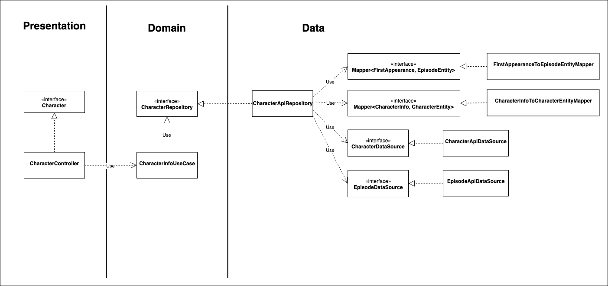

# Rick and Morty

## Diagrama de Clases



## El Problema
 Usando la api pública: [https://rickandmortyapi.com/], debemos crear la siguiente respuesta de la información de un personaje:

```json
{
    "name": "Rick Sanchez",
    "status": "Alive",
    "species": "Human",
    "gender": "Male",
    "firstAppearance": {
        "name": "Pilot",
        "code": "S01E01"
    }
}
```

Para hacer esto, necesitamos hacer dos peticiones. La primera va traer la información del personaje usando este endpoint:
`/api/character/{characterId}`

```json
{
    "id": 1,
    "name": "Rick Sanchez",
    "status": "Alive",
    "species": "Human",
    "type": "",
    "gender": "Male",
    "origin": {
        "name": "Earth (C-137)",
        "url": "https://rickandmortyapi.com/api/location/1"
    },
    "location": {
        "name": "Earth (Replacement Dimension)",
        "url": "https://rickandmortyapi.com/api/location/20"
    },
    "image": "https://rickandmortyapi.com/api/character/avatar/1.jpeg",
    "episode": [
        "https://rickandmortyapi.com/api/episode/1",
        "https://rickandmortyapi.com/api/episode/2",
        "https://rickandmortyapi.com/api/episode/3",
        "https://rickandmortyapi.com/api/episode/4",
        "https://rickandmortyapi.com/api/episode/5",
        "https://rickandmortyapi.com/api/episode/6",
        "https://rickandmortyapi.com/api/episode/7",
        "https://rickandmortyapi.com/api/episode/8",
        "https://rickandmortyapi.com/api/episode/9",
        "https://rickandmortyapi.com/api/episode/10",
        "https://rickandmortyapi.com/api/episode/11",
        "https://rickandmortyapi.com/api/episode/12",
        "https://rickandmortyapi.com/api/episode/13",
        "https://rickandmortyapi.com/api/episode/14",
        "https://rickandmortyapi.com/api/episode/15",
        "https://rickandmortyapi.com/api/episode/16",
        "https://rickandmortyapi.com/api/episode/17",
        "https://rickandmortyapi.com/api/episode/18",
        "https://rickandmortyapi.com/api/episode/19",
        "https://rickandmortyapi.com/api/episode/20",
        "https://rickandmortyapi.com/api/episode/21",
        "https://rickandmortyapi.com/api/episode/22",
        "https://rickandmortyapi.com/api/episode/23",
        "https://rickandmortyapi.com/api/episode/24",
        "https://rickandmortyapi.com/api/episode/25",
        "https://rickandmortyapi.com/api/episode/26",
        "https://rickandmortyapi.com/api/episode/27",
        "https://rickandmortyapi.com/api/episode/28",
        "https://rickandmortyapi.com/api/episode/29",
        "https://rickandmortyapi.com/api/episode/30",
        "https://rickandmortyapi.com/api/episode/31"
    ],
    "url": "https://rickandmortyapi.com/api/character/1",
    "created": "2017-11-04T18:48:46.250Z"
}
```

Y con el array de episodios `episode` vamos a extraer el primer elemento y hacer la siguiente petición para obtener más información acerca de este:
`/api/episode/{episideId}`

```json
{
    "id": 1,
    "name": "Pilot",
    "air_date": "December 2, 2013",
    "episode": "S01E01",
    "characters": [
        "https://rickandmortyapi.com/api/character/1",
        "https://rickandmortyapi.com/api/character/2",
        "https://rickandmortyapi.com/api/character/35",
        "https://rickandmortyapi.com/api/character/38",
        "https://rickandmortyapi.com/api/character/62",
        "https://rickandmortyapi.com/api/character/92",
        "https://rickandmortyapi.com/api/character/127",
        "https://rickandmortyapi.com/api/character/144",
        "https://rickandmortyapi.com/api/character/158",
        "https://rickandmortyapi.com/api/character/175",
        "https://rickandmortyapi.com/api/character/179",
        "https://rickandmortyapi.com/api/character/181",
        "https://rickandmortyapi.com/api/character/239",
        "https://rickandmortyapi.com/api/character/249",
        "https://rickandmortyapi.com/api/character/271",
        "https://rickandmortyapi.com/api/character/338",
        "https://rickandmortyapi.com/api/character/394",
        "https://rickandmortyapi.com/api/character/395",
        "https://rickandmortyapi.com/api/character/435"
    ],
    "url": "https://rickandmortyapi.com/api/episode/1",
    "created": "2017-11-10T12:56:33.798Z"
}
```